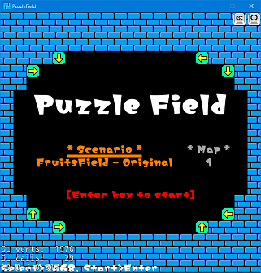
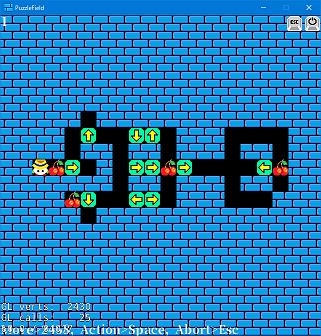
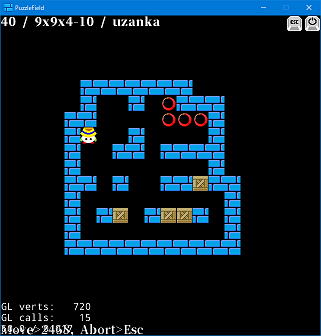

# PuzzleField
Puzzle game platform.

## Description
PuzzleField is puzzle game platform.
You can play with the following 2 puzzle games.
- FruitsField
- Sokoban

## Requirement
PuzzleField will run on Windows (desktop application).
Keyboard is necessary for play.

## Usage
1. Run PuzzleField.exe.
1. In puzzle game select window:
    1. Use the up/down/8/2 keys to select puzzle (scenario).
    1. Use the left/right/4/6 keys to move scenario/map field.
    1. Use the up/down/8/2 keys to select map.
    1. Hit enter key to start game.

### FruitsField
1. Up/Down/Left/Right/8/2/4/6 keys to move player.
   And catch all fruits in map.
2. Space key to action arrow block.
   The arrow block does not stop until it hits an obstacle.
   The arrow block with obstacles will disappear ahead.
   The opposite arrow block can not be erased.
3. Esc key to abort game, and return to select window.

### Sokoban
1. Up/Down/Left/Right/8/2/4/6 keys to move player or push box.
   And move all boxes to goal.
2. Esc key to abort game, and return to select window.

## Build
The following environment is necessary to build.
- Visual Studio 2017
- cocos2d-x ver3.17 for windows is download at "http://www.cocos2d-x.org/", and install.
- Font "emoir-kaku.ttf" is "http://modi.jpn.org/font_memoir.php".
  Font "SoukouMincho.ttf" is "https://flopdesign.com/blog/font/5228/".
  You can use other any fonts supported cocos2d-x.

## Development
### Add puzzle maps:
1. Store json/map/slc style map file in "FruitsField/" or "Sokoban/" folder.
   It support 3 kinds of map styles.
    - Json style: See "fruits_field_original.json".
    - Map style: Text style. See "sokoban_uzanka_6x6.map".
    - Slc style: XML style. See web pages containing maps.
1. Add new title information in "puzzle_field.json" file.

### Add puzzle:
1. Implement new puzzle class. Make rule, images, maps, ... etc.
1. Add new class to PuzzleFieldSceneFactory class for create new scene.
1. Add new puzzle class json for characters (ex: "class_NewPuzzle.json").
1. Add new title information in "puzzle_field.json" file.

### Result information:
Cleared result is saved in "C:/Users/{username}/AppData/Local/PuzzleField/UserDefault.xml".
This is specification of cocos2d-x.

## Licence
GNU General Public License v3.0

Libraries, fonts and other licenses used in PuzzleField are follow their respective licenses.
